# Alyac Market

## 1. 프로젝트 개요

이스트소프트 프론트엔드 개발과정 10기
3차 프로젝트 : SNS 오픈마켓 개발

### 1.1 목표

- 모바일 친화적인 SNS 오픈마켓 웹 애플리케이션 개발
- 사용자 간 상품 거래 및 소통 지원

### 1.2 팀원

- 팀장: 김동희
- 팀원: 김세윤, 배준우, 장영재

### 1.3 마일스톤

```mermaid
gantt
    title Alyac Market 개발 마일스톤
    dateFormat  D
    axisFormat  Day %d

    section 기획 · 환경
    프로젝트 기획 및 역할 분담          :done, d1, 1, 1d
    FSD 규칙 확립 · 코드 컨벤션         :done, d1b, 1, 2d
    개발 환경 설정 (Vite, Prettier)     :done, d3, 3, 2d

    section 인증 · 프로필
    Auth / User 타입 정의               :done, d2a, 2, 1d
    회원가입 페이지 · 유효성 검사        :done, d3a, 3, 1d
    프로필 페이지 구현                   :done, d2b, 2, 3d
    프로필 커스텀 훅 분리                :done, d3b, 3, 1d
    로그인 Nav · 설정 Modal             :done, d4a, 4, 1d

    section UI · 컴포넌트
    버튼 SVG · shared/ui/button         :done, d2c, 2, 1d
    버튼 CVA 전환 · SVG 컴포넌트화      :done, d3c, 3, 1d
    공통 버튼 컴포넌트 (저장 · 업로드)  :done, d4b, 4, 1d
    SVG 아이콘 전면 교체                 :done, d6a, 6, 2d
    피드 페이지 UI 개선                  :done, d8a, 8, 1d
    포스트 페이지 UI (푸터 · 모달)       :done, d9a, 9, 1d

    section 라우팅
    라우터 동적 로딩 · 경로 통일         :done, d3d, 3, 1d
    팔로워 / 프로필 수정 라우팅          :done, d4c, 4, 1d

    section FSD 리팩토링
    FSD 계층 구조 재정비                 :done, d5a, 5, 1d
    피드 · 검색 페이지 FSD 리팩토링     :done, d6b, 6, 3d

    section 데이터 페칭
    useEffect → useQuery 리팩토링       :done, d5b, 5, 1d
    QueryClient 전역 설정 · 토큰 검증   :done, d9b, 9, 1d
    피드 무한 스크롤 (useInfiniteQuery) :done, d9c, 9, 1d

    section 검색 · 피드
    피드 · 검색 페이지 초기 구현         :done, d1c, 1, 2d
    검색 기능 뼈대                        :done, d6c, 6, 1d
    검색 기능 완성 · 팔로잉 피드 연동    :done, d7a, 7, 1d

    section Day 10
    TBD                                  :active, d10, 10, 1d
```



#### Day 1 — 프로젝트 기획 및 역할 분담

| 팀원          | 담당 파트                  |
| ------------- | -------------------------- |
| 김동희 (팀장) | 피드 페이지, 검색 페이지   |
| 김세윤        | 프로필 파트                |
| 배준우        | 로그인 파트                |
| 장영재        | 공통 컴포넌트(shared) 파트 |

- FSD(Feature-Sliced Design) 폴더 구조 규칙 확립
- 컴포넌트 작성 및 코드 컨벤션 합의

---

#### Day 2 — 기능별 초기 구현 시작

| 팀원   | 작업 내용                                              |
| ------ | ------------------------------------------------------ |
| 김동희 | 피드 페이지·검색 페이지 초기 구현                      |
| 김세윤 | 프로필 페이지 구현 시작                                |
| 배준우 | `Auth` / `User` 타입 정의 및 `token.ts` 작성           |
| 장영재 | 버튼 SVG 에셋 추가 및 `shared/ui/button` 컴포넌트 구현 |

---

#### Day 3 — 회원가입·프로필·라우팅·환경 설정

- **회원가입 및 프로필 기능 구현**: 회원가입(SignUp) 페이지와 프로필 관련 API 호출 로직 작성, 유효성 검사 추가
- **컴포넌트 리팩터링 및 UI 고도화**: 버튼을 CVA 기반으로 전환, SVG 컴포넌트화, 커스텀 훅(`useProfile`, `useImageUpload`) 분리
- **라우팅 및 네비게이션 최적화**: 라우터를 동적 로딩(Lazy Loading) 방식으로 변경, 페이지 경로 통일 및 그룹화
- **개발 환경 설정 보완**: Vite 프록시 설정으로 DB 통신 확인, 토큰 갱신 에러 처리 및 테마 설정 추가
- **코드 정리 및 충돌 해결**: `develop` 브랜치 병합 충돌 해결, 불필요한 주석 및 파일명 정리

---

#### Day 4 — 네비게이션 구조 및 공통 UI 정의

- 로그인 후 메인 Nav의 "설정 및 개인정보" 항목을 Modal로 구현, 클릭 시 프로필 수정 페이지로 이동
- 팔로워 페이지 전용 팔로우 Nav 컴포넌트를 팔로우 페이지 내에 작성
- 프로필 저장 버튼·게시글 업로드 버튼을 `shared` 폴더에 공통 컴포넌트로 분리하여 각 페이지에 적용
- 페이지별 헤더 관리 방식 논의 (버튼 헤더의 API 연결 및 버튼 명칭 문제 포함)
- Prettier 공유 설정 누락 문제 해결

---

#### Day 5 — FSD 구조 정비 및 데이터 페칭 리팩토링

- FSD 계층 구조(`app → pages → widgets → features → entities → shared`) 전면 재점검 및 정리
- `useEffect` 기반 수동 API 호출 방식을 `useQuery`(React Query) 방식으로 일괄 리팩토링
- 프로젝트 내 가이드 파일(`FSDguide.md`) 기준으로 레이어 위반 사항 수정

---

#### Day 6 — 검색 뼈대 구현 및 환경 이슈 해결

- 검색 기능 UI·라우팅 뼈대 구현 (로직 미완성)
- SVG 아이콘 전면 교체 작업 진행 중
- FSD 폴더 구조 리팩토링 진행 중
- `npm run format` 자동화가 동작하지 않는 문제 발견 → Prettier 팀 동기화 완료

---

#### Day 7 — 검색 기능 완성 및 피드 연동

- 검색 기능 완료: 팔로잉한 사용자의 게시글·상품이 피드에 노출되도록 구현
- `feed` 페이지·`search` 페이지 FSD 리팩토링 거의 완료

---

#### Day 8 — 피드 페이지 UI 개선

- 피드 페이지 전체 UI 수정 완료
- `feed` 페이지·`search` 페이지 FSD 리팩토링 마무리 단계

---

#### Day 9 — 무한 스크롤 및 포스트 UI 고도화

- 피드 페이지 무한 스크롤(`useInfiniteQuery`) 구현
- 포스트 페이지 UI 개선: 푸터, 이미지 미리보기, 모달 추가
- 토큰 검증 로직 추가 및 `QueryClient` 전역 설정 정비

---

#### Day 10 — (작업 중)

### 1.4 주요 기능

- 회원가입/로그인/로그아웃
- 상품 등록, 수정, 삭제
- 상품 목록 및 상세 조회
- 채팅 기능
- 댓글 및 좋아요
- 검색 및 필터링

## 2. 개발 환경 및 배포

### 2.1 개발 스택

- 프론트엔드: React, TypeScript, Vite
- 백엔드: Node.js, Express
- 데이터베이스: DB
- 스타일: CSS Modules, TailwindCSS
- 기타: Axios, Zustand, React Query

### 2.2 배포 URL

- 프론트엔드: []()
- 백엔드: []()

## 3. 라우팅 구조

- / (홈)
- /feed (피드)
- /product/:id (상품 상세)
- /post/:id (게시글 상세)
- /chat (채팅 목록)
- /chat-room/:id (채팅방)
- /profile (내 프로필)
- /search (검색)
- /signin, /signup (인증)

## 4. 데이터 흐름

1. 클라이언트는 REST API를 통해 서버와 통신합니다.
2. 상태 관리는 주로 Zustand, React Query로 처리합니다.
3. 인증 정보는 로컬스토리지/쿠키에 저장됩니다.

## 5. 프로젝트 구조

```
src/
  app/           # 앱 엔트리포인트 및 라우팅
  entities/      # 도메인별 API, 타입, 훅
  features/      # 주요 기능 단위별 폴더
  pages/         # 라우트별 페이지 컴포넌트
  shared/        # 공통 컴포넌트, 훅, 유틸
  widgets/       # UI 위젯
```

## 6. 아키텍처

- Atomic Design, FSD(Folder-by-Feature) 구조 적용
- 클라이언트-서버 분리, API 통신
- 상태 관리: 전역(Zustand), 서버 상태(React Query)

## 7. 실행 방법

1. 백엔드 서버 실행

alyac-market-server-main

```bash
npm install
npm run start
```

2. 프론트엔드 서버 실행

3rd-project

```bash
cd 3rd-project
npm install
npm run dev
```

## 8. 테스트 계정

- 아이디: / 비밀번호:
- 아이디: / 비밀번호:
