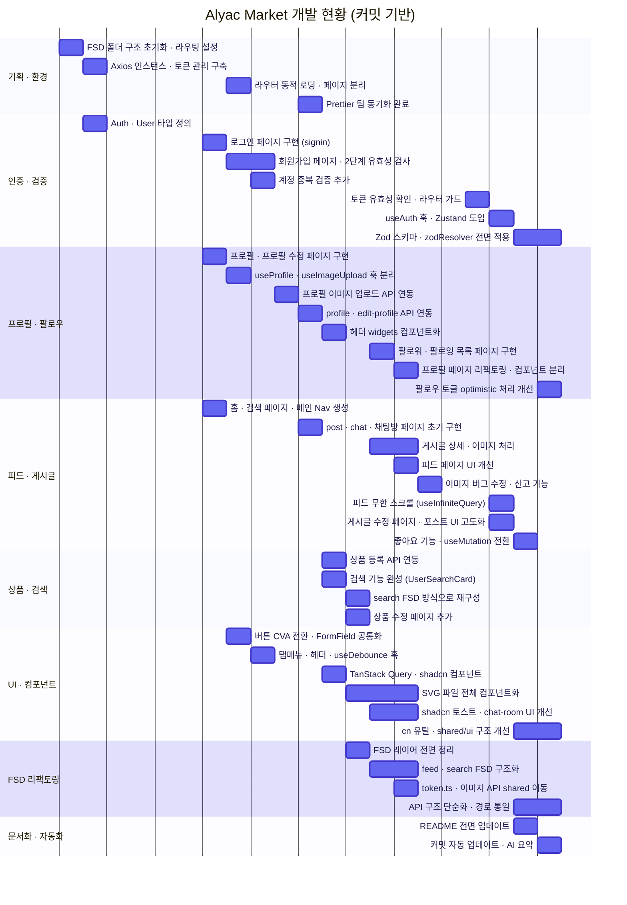
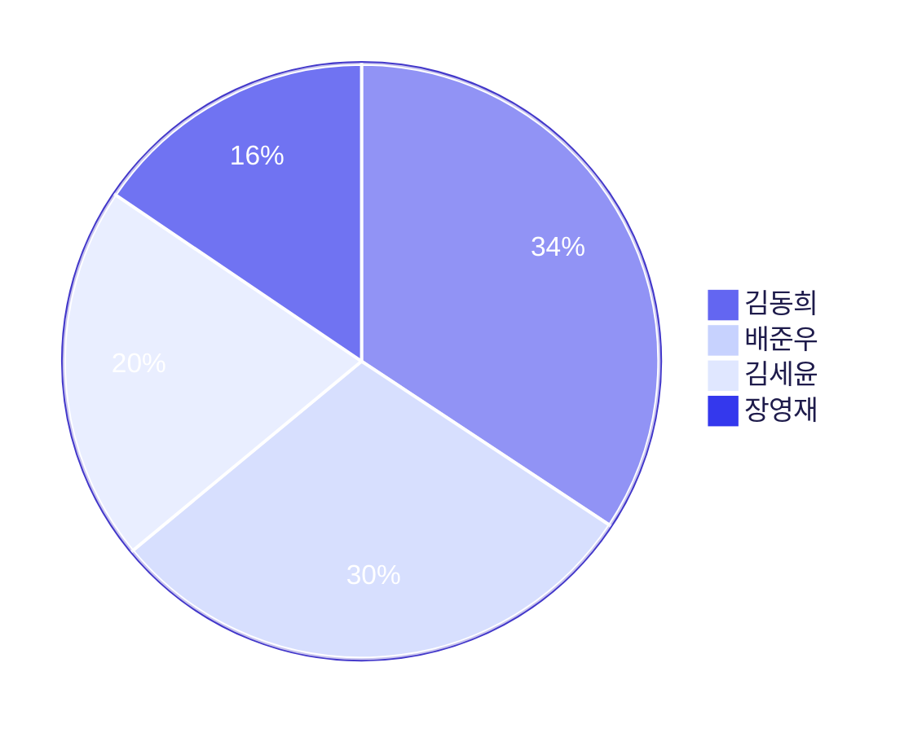
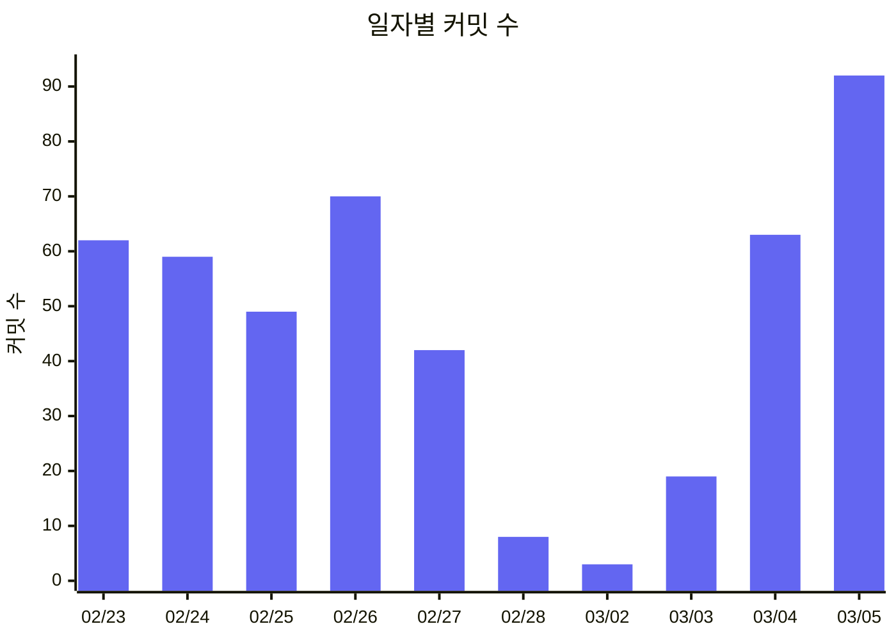

# Alyac Market

## 1. 프로젝트 개요

이스트소프트 프론트엔드 개발과정 10기
3차 프로젝트 : SNS 오픈마켓 개발

### 1.1 목표

- 모바일 친화적인 SNS 오픈마켓 웹 애플리케이션 개발
- 사용자 간 상품 거래 및 소통 지원

### 1.2 팀원

- 팀장: 김동희
- 팀원: 김세윤, 배준우, 장영재

### 1.3 마일스톤



#### Day 1 — 프로젝트 기획 및 역할 분담 (2026-02-13)

| 팀원          | 담당 파트                  |
| ------------- | -------------------------- |
| 김동희 (팀장) | 피드 페이지, 검색 페이지   |
| 김세윤        | 프로필 파트                |
| 배준우        | 로그인 파트                |
| 장영재        | 공통 컴포넌트(shared) 파트 |

- FSD(Feature-Sliced Design) 폴더 구조 규칙 확립
- 컴포넌트 작성 및 코드 컨벤션 합의

---

#### Day 2 — 기능별 초기 구현 시작 (2026-02-19)

- 피드 페이지·검색 페이지 초기 구현
- 프로필 페이지 구현 시작
- `Auth` / `User` 타입 정의 및 `token.ts` 작성
- 버튼 SVG 에셋 추가 및 `shared/ui/button` 컴포넌트 구현

---

#### Day 3 — 회원가입·프로필·라우팅·환경 설정 (2026-02-20)

- **회원가입 및 프로필 기능 구현**: 회원가입(SignUp) 페이지와 프로필 관련 API 호출 로직 작성, 유효성 검사 추가
- **컴포넌트 리팩터링 및 UI 고도화**: 버튼을 CVA 기반으로 전환, SVG 컴포넌트화, 커스텀 훅(`useProfile`, `useImageUpload`) 분리
- **라우팅 및 네비게이션 최적화**: 라우터를 동적 로딩(Lazy Loading) 방식으로 변경, 페이지 경로 통일 및 그룹화
- **개발 환경 설정 보완**: Vite 프록시 설정으로 DB 통신 확인, 토큰 갱신 에러 처리 및 테마 설정 추가
- **코드 정리 및 충돌 해결**: `develop` 브랜치 병합 충돌 해결, 불필요한 주석 및 파일명 정리

---

#### Day 4 — 네비게이션 구조 및 공통 UI 정의 (2026-02-23)

- 로그인 후 메인 Nav의 "설정 및 개인정보" 항목을 Modal로 구현, 클릭 시 프로필 수정 페이지로 이동
- 팔로워 페이지 전용 팔로우 Nav 컴포넌트를 팔로우 페이지 내에 작성
- 프로필 저장 버튼·게시글 업로드 버튼을 `shared` 폴더에 공통 컴포넌트로 분리하여 각 페이지에 적용
- 페이지별 헤더 관리 방식 논의 (버튼 헤더의 API 연결 및 버튼 명칭 문제 포함)
- Prettier 공유 설정 누락 문제 해결

---

#### Day 5 — FSD 구조 정비 및 데이터 페칭 리팩토링 (2026-02-24)

- FSD 계층 구조(`app → pages → widgets → features → entities → shared`) 전면 재점검 및 정리
- `useEffect` 기반 수동 API 호출 방식을 `useQuery`(React Query) 방식으로 일괄 리팩토링
- 프로젝트 내 가이드 파일(`FSDguide.md`) 기준으로 레이어 위반 사항 수정

---

#### Day 6 — 검색 뼈대 구현 및 환경 이슈 해결 (2026-02-25)

- 검색 기능 UI·라우팅 뼈대 구현 (로직 미완성)
- SVG 아이콘 전면 교체 작업 진행 중
- FSD 폴더 구조 리팩토링 진행 중
- `npm run format` 자동화가 동작하지 않는 문제 발견 → Prettier 팀 동기화 완료

---

#### Day 7 — 검색 기능 완성 및 피드 연동 (2026-02-26)

- 검색 기능 완료: 팔로잉한 사용자의 게시글·상품이 피드에 노출되도록 구현
- `feed` 페이지·`search` 페이지 FSD 리팩토링 거의 완료

---

#### Day 8 — 피드 페이지 UI 개선 (2026-02-27)

- 피드 페이지 전체 UI 수정 완료
- `feed` 페이지·`search` 페이지 FSD 리팩토링 마무리 단계

---

#### Day 9 — 무한 스크롤 및 포스트 UI 고도화 (2026-03-03)

- 피드 페이지 무한 스크롤(`useInfiniteQuery`) 구현
- 포스트 페이지 UI 개선: 푸터, 이미지 미리보기, 모달 추가
- 토큰 검증 로직 추가 및 `QueryClient` 전역 설정 정비

---

#### Day 10 — 문서화 · 코드 정리 · 기능 마무리 (2026-03-04)

- **문서화**: README 전면 업데이트 — 개발 스택 버전 표, 라우팅 구조 표, API 엔드포인트 목록, 아키텍처 Flowchart, 마일스톤 gantt 실제 날짜 적용
- **유틸 · 검증 도입**: `cn` 유틸 함수 추가, `zod` 스키마 검증 전면 도입
- **기능 구현**: 좋아요(heart) 기능 임시 구현
- **코드 정리**: 레거시 코드 제거, 임포트 경로 통일
- **구조 정비**: FSD 계층 기준 위반 항목 최종 재정비

### 1.4 주요 기능

| 기능   | 설명                                          |
| ------ | --------------------------------------------- |
| 인증   | 회원가입 · 로그인 · 로그아웃 · 토큰 자동 갱신 |
| 프로필 | 프로필 조회 · 수정 · 팔로우 / 언팔로우        |
| 팔로우 | 팔로워 / 팔로잉 목록 조회                     |
| 피드   | 팔로잉 사용자 게시글 무한 스크롤              |
| 게시글 | 작성 · 수정 · 삭제 · 이미지 첨부 (최대 3장)   |
| 좋아요 | 게시글 좋아요 / 취소                          |
| 댓글   | 댓글 작성 · 목록 · 삭제 · 신고                |
| 상품   | 상품 등록 · 수정 · 삭제 · 목록 조회           |
| 검색   | 계정명 기반 사용자 검색                       |
| 채팅   | 채팅 목록 · 채팅방 (UI 구현)                  |

## 2. 개발 환경 및 배포

### 2.1 개발 스택

| 분류        | 기술                         | 버전  |
| ----------- | ---------------------------- | ----- |
| 프레임워크  | React                        | 19.2  |
| 언어        | TypeScript                   | 5.9   |
| 빌드        | Vite                         | 7.3   |
| 라우팅      | React Router DOM             | 7.13  |
| 서버 상태   | TanStack Query (React Query) | 5.90  |
| 전역 상태   | Zustand                      | 5.0   |
| HTTP        | Axios                        | 1.13  |
| 폼 / 검증   | React Hook Form + Zod        | 7 / 4 |
| 스타일      | Tailwind CSS v4              | 4.1   |
| UI 컴포넌트 | Radix UI · CVA · shadcn/ui   | -     |
| 토스트      | Sonner                       | 2.0   |
| 백엔드      | Node.js · Express            | -     |
| DB          | JSON Server (db.json)        | -     |

### 2.2 배포 URL

- 프론트엔드: []()
- 백엔드: []()

## 3. 라우팅 구조

### 3.1 비인증 페이지 (RequireGuest)

| 경로              | 페이지                      |
| ----------------- | --------------------------- |
| `/`               | 홈 (스플래시 · 서비스 소개) |
| `/signin`         | 로그인                      |
| `/signup`         | 회원가입                    |
| `/signup/profile` | 회원가입 — 프로필 설정      |

### 3.2 인증 필요 페이지 (RequireAuth)

| 경로                       | 페이지                    |
| -------------------------- | ------------------------- |
| `/feed`                    | 팔로잉 피드               |
| `/search`                  | 사용자 검색               |
| `/profile`                 | 내 프로필                 |
| `/profile/:accountname`    | 타 사용자 프로필          |
| `/edit-profile`            | 프로필 수정               |
| `/create-product`          | 상품 등록                 |
| `/edit-product/:productId` | 상품 수정                 |
| `/create-post`             | 게시글 작성               |
| `/post/:postId`            | 게시글 상세 (댓글·좋아요) |
| `/post/:postId/edit`       | 게시글 수정               |
| `/chat`                    | 채팅 목록                 |
| `/chat/:roomId`            | 채팅방                    |
| `/followers/:accountname`  | 팔로워 목록               |
| `/followings/:accountname` | 팔로잉 목록               |
| `*`                        | 404 Not Found             |

## 4. 데이터 흐름

1. 클라이언트는 Axios를 통해 `/api/*` 경로로 REST API 요청을 보냅니다. (Vite 프록시 → `http://localhost:3000`)
2. 서버 상태는 **TanStack Query**가 캐싱·동기화하고, 전역 UI 상태는 **Zustand**로 관리합니다.
3. 인증 토큰(accessToken · refreshToken)은 **LocalStorage**에 저장되며, Axios 인터셉터가 요청마다 자동 첨부합니다.
4. 토큰 만료 시 `/api/user/refresh` 로 자동 재발급 후 원래 요청을 재시도합니다.

### 4.1 주요 API 엔드포인트

| 분류   | 메서드 | 경로                                      | 설명                           |
| ------ | ------ | ----------------------------------------- | ------------------------------ |
| 인증   | POST   | `/api/user`                               | 회원가입                       |
| 인증   | POST   | `/api/user/signin`                        | 로그인                         |
| 인증   | POST   | `/api/user/refresh`                       | 토큰 재발급                    |
| 인증   | GET    | `/api/user/checktoken`                    | 토큰 유효성 검사               |
| 인증   | POST   | `/api/user/emailvalid`                    | 이메일 중복 확인               |
| 인증   | POST   | `/api/user/accountnamevalid`              | 계정명 중복 확인               |
| 사용자 | GET    | `/api/user/myinfo`                        | 내 정보 조회                   |
| 사용자 | PUT    | `/api/user`                               | 프로필 수정                    |
| 사용자 | GET    | `/api/user/searchuser`                    | 사용자 검색                    |
| 프로필 | GET    | `/api/profile/:accountname`               | 프로필 조회                    |
| 프로필 | POST   | `/api/profile/:accountname/follow`        | 팔로우                         |
| 프로필 | DELETE | `/api/profile/:accountname/unfollow`      | 언팔로우                       |
| 프로필 | GET    | `/api/profile/:accountname/following`     | 팔로잉 목록                    |
| 프로필 | GET    | `/api/profile/:accountname/follower`      | 팔로워 목록                    |
| 게시글 | POST   | `/api/post`                               | 게시글 작성                    |
| 게시글 | GET    | `/api/post/feed`                          | 팔로잉 피드                    |
| 게시글 | GET    | `/api/post/:accountname/userpost`         | 사용자 게시글                  |
| 게시글 | GET    | `/api/post/:post_id`                      | 게시글 상세                    |
| 게시글 | PUT    | `/api/post/:post_id`                      | 게시글 수정                    |
| 게시글 | DELETE | `/api/post/:post_id`                      | 게시글 삭제                    |
| 좋아요 | POST   | `/api/post/:post_id/heart`                | 좋아요                         |
| 좋아요 | DELETE | `/api/post/:post_id/unheart`              | 좋아요 취소                    |
| 댓글   | POST   | `/api/post/:post_id/comments`             | 댓글 작성                      |
| 댓글   | GET    | `/api/post/:post_id/comments`             | 댓글 목록                      |
| 댓글   | DELETE | `/api/post/:post_id/comments/:comment_id` | 댓글 삭제                      |
| 상품   | POST   | `/api/product`                            | 상품 등록                      |
| 상품   | GET    | `/api/product/:accountname`               | 사용자 상품 목록               |
| 상품   | GET    | `/api/product/detail/:product_id`         | 상품 상세                      |
| 상품   | PUT    | `/api/product/:product_id`                | 상품 수정                      |
| 상품   | DELETE | `/api/product/:product_id`                | 상품 삭제                      |
| 이미지 | POST   | `/api/image/uploadfile`                   | 단일 이미지 업로드             |
| 이미지 | POST   | `/api/image/uploadfiles`                  | 다중 이미지 업로드 (최대 10개) |

## 5. 프로젝트 구조

FSD(Feature-Sliced Design) 아키텍처를 적용합니다. 상위 레이어는 하위 레이어만 참조할 수 있습니다.

```
src/
  app/           # 앱 진입점 · 라우터 · QueryClient · 전역 Provider
  pages/         # 라우트별 페이지 조립 (18개 페이지)
  widgets/       # 독립적 UI 블록 (TopNav 6종, TabMenu)
  features/      # 사용자 시나리오 단위 (auth, feed, post, product, profile, chat, search, home, create-post)
  entities/      # 도메인 모델 · API · 훅 (auth, feed, post, product, user)
  shared/        # 도메인 무관 공용 기반 (axiosInstance, ui/, hooks/, lib/)
```

### 5.1 레이어별 도메인

| 레이어           | 포함 도메인 / 모듈                                                                                   |
| ---------------- | ---------------------------------------------------------------------------------------------------- |
| **entities**     | `auth` · `feed` · `post` · `product` · `user`                                                        |
| **features**     | `auth` · `chat` · `create-post` · `feed` · `home` · `post` · `product` · `profile` · `search`        |
| **widgets**      | `top-basic-nav` · `top-chat-nav` · `top-main-nav` · `top-search-nav` · `top-upload-nav` · `tab-menu` |
| **shared/ui**    | `button` · `feedback` · `form` · `modal` · `user`                                                    |
| **shared/hooks** | `useDebounce` · `useImageUpload`                                                                     |
| **shared/lib**   | `cn` · `getImageUrl` · token 관리 · theme                                                            |

## 6. 아키텍처

- FSD(Feature-Sliced Design) 계층 구조 적용 (`app → pages → widgets → features → entities → shared`)
- 클라이언트-서버 분리, Axios 기반 REST API 통신 (Vite 프록시)
- 상태 관리: 전역 UI(Zustand) + 서버 상태·캐싱(TanStack Query)
- 폼 유효성: React Hook Form + Zod 스키마 검증


## 7. 실행 방법

1. 백엔드 서버 실행

alyac-market-server-main

```bash
npm install
npm run start
```

2. 프론트엔드 서버 실행

3rd-project

```bash
cd 3rd-project
npm install
npm run dev
```

## 8. 테스트 계정

- 아이디: / 비밀번호:
- 아이디: / 비밀번호:

## 9. 커밋 활동

> **자동 업데이트** — GitHub Actions 워크플로우(`.github/workflows/update-readme-chart.yml`)가 `main` / `develop` 브랜치에 푸시될 때마다 아래 차트를 갱신합니다.

### 9.1 기여자별 커밋 수

<!-- COMMIT-PIE-START -->

<!-- COMMIT-PIE-END -->

### 9.2 일자별 커밋 수

<!-- COMMIT-BAR-START -->

<!-- COMMIT-BAR-END -->

### 9.3 날짜별 커밋 로그

<!-- COMMIT-LOG-START -->

| """        | 날짜                                                                                                                                                                                                                                                      | 요약 |
| ---------- | --------------------------------------------------------------------------------------------------------------------------------------------------------------------------------------------------------------------------------------------------------- | ---- |
| 2026-03-05 | README 기여자 누락 수정 및 커밋 자동 업데이트 기능 추가. 다크모드 Mermaid 차트 색상 고정 및 10일차 내용 개선. 팔로우 토글 optimistic 처리 개선 및 cn 클래스 전체 통일. Zod 스키마 검증을 게시글 작성·프로필 수정 폼에 zodResolver로 연동.                 |
| 2026-03-04 | 회원가입·로그인·프로필 수정·게시글 작성 전 폼에 Zod 스키마 검증 적용. post/product 엔티티 API 구조 단순화 및 chat 파일 features로 이동 등 FSD 기준 리팩토링. 피드 좋아요 기능 구현 및 좋아요 카운트 동기화. shared/ui 폴더 구조 개선 및 레거시 코드 정리. |
| 2026-03-03 | 피드 무한 스크롤 동작 수정. async/await 방식을 useMutation으로 전환하고 오류 시 toast 알림 추가. useAuth 훅 추가 및 Zustand 설치. 게시글 수정(edit-post) 페이지 추가 및 token.ts axios로 전환.                                                            |
| 2026-03-02 | 토큰 유효성 확인 로직 추가 및 라우터 가드 수정. QueryClient 전역 설정 추가.                                                                                                                                                                               |
| 2026-02-28 | 게시글 이미지 없을 때 기본 프로필 이미지 오노출 버그 수정. SVG 아이콘 컴포넌트 교체 완료 후 기존 이미지 파일 제거. FollowUserListItem 프로필 사진 위치 및 ChatRoomFooter SVG 교체. 좋아요 버튼 활성화 오류 수정.                                          |
| 2026-02-27 | token.ts를 shared/lib으로 이동. 전체 nav/tab 커서 포인터 및 TopBasicNav 링크 수정. 프로필 페이지 리팩토링 및 컴포넌트 분리. chat-room LeaveRoomModal을 드롭다운 스타일로 변경. 전 페이지에 걸쳐 SVG 컴포넌트 교체 완료 및 공통 이미지 업로드 API 적용.    |
| 2026-02-26 | SVG 파일 컴포넌트화 완료 및 전 페이지 적용. 팔로잉 게시글 안 보이는 문제 해결. followers/followings 목록 페이지 구현. feed FSD 구조화 및 shadcn 토스트 추가. 이미지 업로드 API shared로 이동. edit-profile 컴포넌트 분리 및 product uploader 구조 정리.   |
| 2026-02-25 | FSD 레이어 전면 정리(profile·product·image 로직 재배치). search를 FSD 방식으로 재구성 및 API 훅 연동. 좋아요 토글 기능 및 하트 아이콘 구현. 상품 수정(edit-product) 페이지 추가. 이미지 파일 PNG→SVG·WebP 전환으로 품질 개선. homepage FSD 분리 적용.     |
| 2026-02-24 | 검색 기능(UserSearchCard, API 연동) 완성. TanStack Query 적용 및 FormField 공통 컴포넌트 구현. 상품 등록 API 연동. 각 페이지 헤더를 widgets 컴포넌트로 교체. 프로필·게시글·채팅방 이미지 URL 절대경로 변환 적용. FSD 구조 개선 및 중복 폴더 정리.         |
| 2026-02-23 | post·chat·chat-room 페이지 초기 구현 및 라우트 추가. Prettier 설정 팀 공유 및 전체 format 적용. profile·post·edit-profile API 연동. 탭메뉴·라우트 경로 정비. 게시글 상세 페이지 생성 및 가격 필드 유효성 검사 추가.                                       |
| 2026-02-22 | 프로필 페이지 API 전 연동(조회·이미지 업로드). 프로필 이미지 업로드 구현 및 기본 이미지 추가. 유효성 검사 메모리 누수 방지 로직 추가.                                                                                                                     |
| 2026-02-21 | signupprofile 계정 중복검증 추가. post·upload·chat·chat-room 페이지 구현 및 라우트 추가. useDebounce 훅 추가. 헤더·탭메뉴 컴포넌트 구현. 이메일 중복검사 기능 추가.                                                                                       |
| 2026-02-20 | signup·signup-profile 페이지 작성 및 유효성 검사 추가. 라우터 동적 로딩으로 전환 및 홈/로그인 페이지 분리. useProfile·useImageUpload 커스텀 훅 분리. 버튼 CVA 기반으로 전환. my-profile·your-profile을 profile 페이지로 통합.                             |
| 2026-02-19 | signin·useSignIn 구현 및 로그인 페이지 스플래시 효과 추가. 프로필·프로필 수정·상품 등록 페이지 구현. 홈페이지와 검색 페이지 연결 및 메인 Nav 생성. SVG 아이콘 추가 및 라우터 초기 정비.                                                                   |
| 2026-02-14 | Axios 인스턴스 구현 및 토큰 갱신 로직 안정화(무한 루프 방어, refreshToken 에러 처리). token.ts 추가. Auth·User 타입 정의.                                                                                                                                 |
| 2026-02-13 | 프로젝트 첫 커밋. FSD 폴더 구조 초기화, 라우팅 설정, RootLayout·Guest 컴포넌트 생성.                                                                                                                                                                      | """  |
