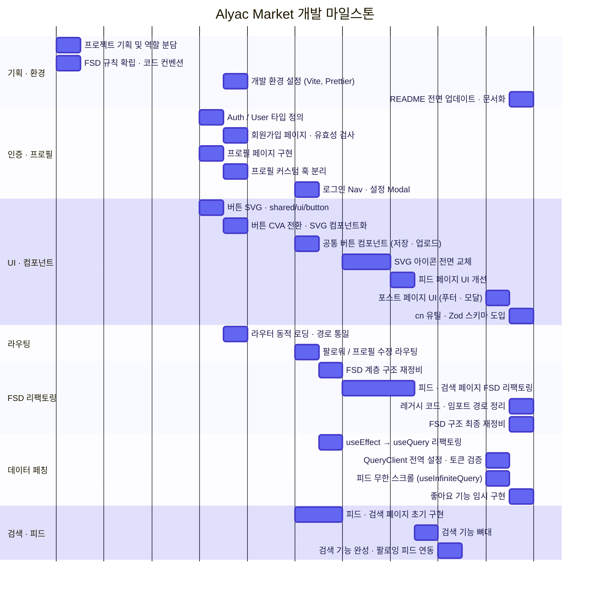
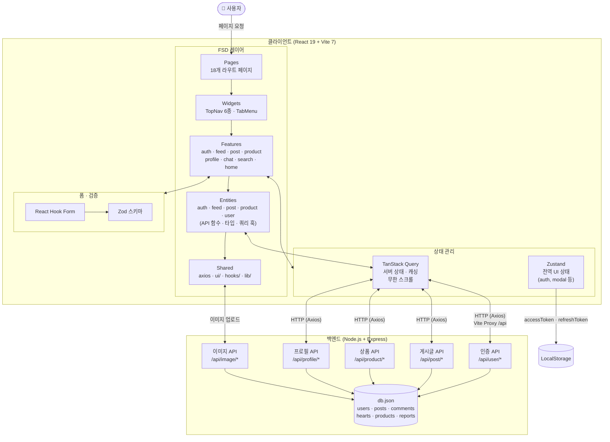
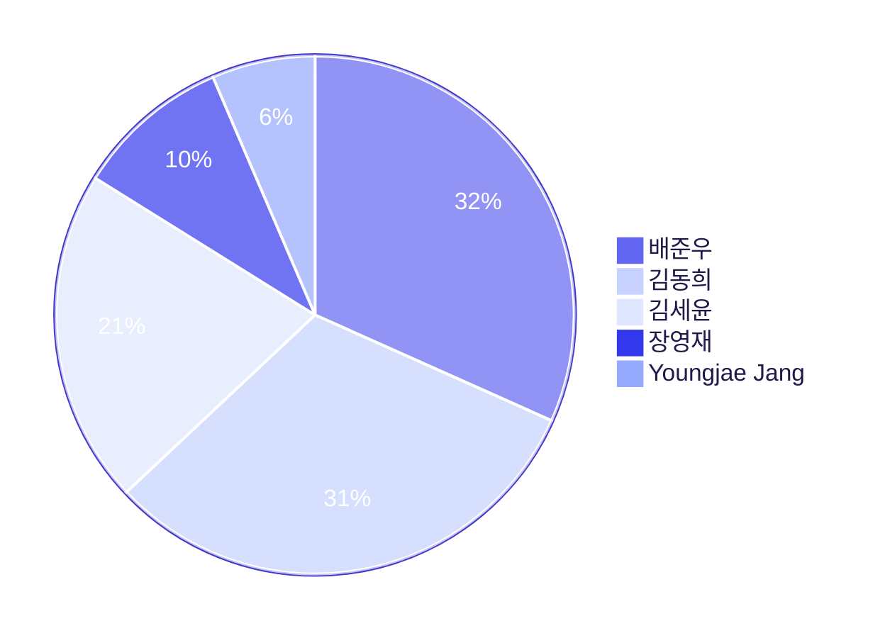
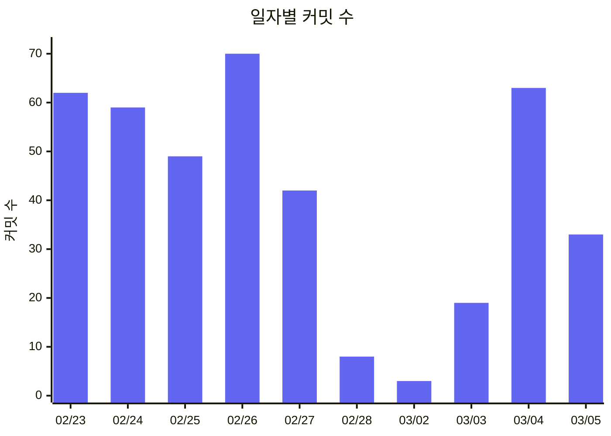

# Alyac Market

## 1. 프로젝트 개요

이스트소프트 프론트엔드 개발과정 10기
3차 프로젝트 : SNS 오픈마켓 개발

### 1.1 목표

- 모바일 친화적인 SNS 오픈마켓 웹 애플리케이션 개발
- 사용자 간 상품 거래 및 소통 지원

### 1.2 팀원

- 팀장: 김동희
- 팀원: 김세윤, 배준우, 장영재

### 1.3 마일스톤



#### Day 1 — 프로젝트 기획 및 역할 분담 (2026-02-13)

| 팀원          | 담당 파트                  |
| ------------- | -------------------------- |
| 김동희 (팀장) | 피드 페이지, 검색 페이지   |
| 김세윤        | 프로필 파트                |
| 배준우        | 로그인 파트                |
| 장영재        | 공통 컴포넌트(shared) 파트 |

- FSD(Feature-Sliced Design) 폴더 구조 규칙 확립
- 컴포넌트 작성 및 코드 컨벤션 합의

---

#### Day 2 — 기능별 초기 구현 시작 (2026-02-19)

- 피드 페이지·검색 페이지 초기 구현
- 프로필 페이지 구현 시작
- `Auth` / `User` 타입 정의 및 `token.ts` 작성
- 버튼 SVG 에셋 추가 및 `shared/ui/button` 컴포넌트 구현

---

#### Day 3 — 회원가입·프로필·라우팅·환경 설정 (2026-02-20)

- **회원가입 및 프로필 기능 구현**: 회원가입(SignUp) 페이지와 프로필 관련 API 호출 로직 작성, 유효성 검사 추가
- **컴포넌트 리팩터링 및 UI 고도화**: 버튼을 CVA 기반으로 전환, SVG 컴포넌트화, 커스텀 훅(`useProfile`, `useImageUpload`) 분리
- **라우팅 및 네비게이션 최적화**: 라우터를 동적 로딩(Lazy Loading) 방식으로 변경, 페이지 경로 통일 및 그룹화
- **개발 환경 설정 보완**: Vite 프록시 설정으로 DB 통신 확인, 토큰 갱신 에러 처리 및 테마 설정 추가
- **코드 정리 및 충돌 해결**: `develop` 브랜치 병합 충돌 해결, 불필요한 주석 및 파일명 정리

---

#### Day 4 — 네비게이션 구조 및 공통 UI 정의 (2026-02-23)

- 로그인 후 메인 Nav의 "설정 및 개인정보" 항목을 Modal로 구현, 클릭 시 프로필 수정 페이지로 이동
- 팔로워 페이지 전용 팔로우 Nav 컴포넌트를 팔로우 페이지 내에 작성
- 프로필 저장 버튼·게시글 업로드 버튼을 `shared` 폴더에 공통 컴포넌트로 분리하여 각 페이지에 적용
- 페이지별 헤더 관리 방식 논의 (버튼 헤더의 API 연결 및 버튼 명칭 문제 포함)
- Prettier 공유 설정 누락 문제 해결

---

#### Day 5 — FSD 구조 정비 및 데이터 페칭 리팩토링 (2026-02-24)

- FSD 계층 구조(`app → pages → widgets → features → entities → shared`) 전면 재점검 및 정리
- `useEffect` 기반 수동 API 호출 방식을 `useQuery`(React Query) 방식으로 일괄 리팩토링
- 프로젝트 내 가이드 파일(`FSDguide.md`) 기준으로 레이어 위반 사항 수정

---

#### Day 6 — 검색 뼈대 구현 및 환경 이슈 해결 (2026-02-25)

- 검색 기능 UI·라우팅 뼈대 구현 (로직 미완성)
- SVG 아이콘 전면 교체 작업 진행 중
- FSD 폴더 구조 리팩토링 진행 중
- `npm run format` 자동화가 동작하지 않는 문제 발견 → Prettier 팀 동기화 완료

---

#### Day 7 — 검색 기능 완성 및 피드 연동 (2026-02-26)

- 검색 기능 완료: 팔로잉한 사용자의 게시글·상품이 피드에 노출되도록 구현
- `feed` 페이지·`search` 페이지 FSD 리팩토링 거의 완료

---

#### Day 8 — 피드 페이지 UI 개선 (2026-02-27)

- 피드 페이지 전체 UI 수정 완료
- `feed` 페이지·`search` 페이지 FSD 리팩토링 마무리 단계

---

#### Day 9 — 무한 스크롤 및 포스트 UI 고도화 (2026-03-03)

- 피드 페이지 무한 스크롤(`useInfiniteQuery`) 구현
- 포스트 페이지 UI 개선: 푸터, 이미지 미리보기, 모달 추가
- 토큰 검증 로직 추가 및 `QueryClient` 전역 설정 정비

---

#### Day 10 — 문서화 · 코드 정리 · 기능 마무리 (2026-03-04)

- **문서화**: README 전면 업데이트 — 개발 스택 버전 표, 라우팅 구조 표, API 엔드포인트 목록, 아키텍처 Flowchart, 마일스톤 gantt 실제 날짜 적용
- **유틸 · 검증 도입**: `cn` 유틸 함수 추가, `zod` 스키마 검증 전면 도입
- **기능 구현**: 좋아요(heart) 기능 임시 구현
- **코드 정리**: 레거시 코드 제거, 임포트 경로 통일
- **구조 정비**: FSD 계층 기준 위반 항목 최종 재정비

### 1.4 주요 기능

| 기능   | 설명                                          |
| ------ | --------------------------------------------- |
| 인증   | 회원가입 · 로그인 · 로그아웃 · 토큰 자동 갱신 |
| 프로필 | 프로필 조회 · 수정 · 팔로우 / 언팔로우        |
| 팔로우 | 팔로워 / 팔로잉 목록 조회                     |
| 피드   | 팔로잉 사용자 게시글 무한 스크롤              |
| 게시글 | 작성 · 수정 · 삭제 · 이미지 첨부 (최대 3장)   |
| 좋아요 | 게시글 좋아요 / 취소                          |
| 댓글   | 댓글 작성 · 목록 · 삭제 · 신고                |
| 상품   | 상품 등록 · 수정 · 삭제 · 목록 조회           |
| 검색   | 계정명 기반 사용자 검색                       |
| 채팅   | 채팅 목록 · 채팅방 (UI 구현)                  |

## 2. 개발 환경 및 배포

### 2.1 개발 스택

| 분류        | 기술                         | 버전  |
| ----------- | ---------------------------- | ----- |
| 프레임워크  | React                        | 19.2  |
| 언어        | TypeScript                   | 5.9   |
| 빌드        | Vite                         | 7.3   |
| 라우팅      | React Router DOM             | 7.13  |
| 서버 상태   | TanStack Query (React Query) | 5.90  |
| 전역 상태   | Zustand                      | 5.0   |
| HTTP        | Axios                        | 1.13  |
| 폼 / 검증   | React Hook Form + Zod        | 7 / 4 |
| 스타일      | Tailwind CSS v4              | 4.1   |
| UI 컴포넌트 | Radix UI · CVA · shadcn/ui   | -     |
| 토스트      | Sonner                       | 2.0   |
| 백엔드      | Node.js · Express            | -     |
| DB          | JSON Server (db.json)        | -     |

### 2.2 배포 URL

- 프론트엔드: []()
- 백엔드: []()

## 3. 라우팅 구조

### 3.1 비인증 페이지 (RequireGuest)

| 경로              | 페이지                      |
| ----------------- | --------------------------- |
| `/`               | 홈 (스플래시 · 서비스 소개) |
| `/signin`         | 로그인                      |
| `/signup`         | 회원가입                    |
| `/signup/profile` | 회원가입 — 프로필 설정      |

### 3.2 인증 필요 페이지 (RequireAuth)

| 경로                       | 페이지                    |
| -------------------------- | ------------------------- |
| `/feed`                    | 팔로잉 피드               |
| `/search`                  | 사용자 검색               |
| `/profile`                 | 내 프로필                 |
| `/profile/:accountname`    | 타 사용자 프로필          |
| `/edit-profile`            | 프로필 수정               |
| `/create-product`          | 상품 등록                 |
| `/edit-product/:productId` | 상품 수정                 |
| `/create-post`             | 게시글 작성               |
| `/post/:postId`            | 게시글 상세 (댓글·좋아요) |
| `/post/:postId/edit`       | 게시글 수정               |
| `/chat`                    | 채팅 목록                 |
| `/chat/:roomId`            | 채팅방                    |
| `/followers/:accountname`  | 팔로워 목록               |
| `/followings/:accountname` | 팔로잉 목록               |
| `*`                        | 404 Not Found             |

## 4. 데이터 흐름

1. 클라이언트는 Axios를 통해 `/api/*` 경로로 REST API 요청을 보냅니다. (Vite 프록시 → `http://localhost:3000`)
2. 서버 상태는 **TanStack Query**가 캐싱·동기화하고, 전역 UI 상태는 **Zustand**로 관리합니다.
3. 인증 토큰(accessToken · refreshToken)은 **LocalStorage**에 저장되며, Axios 인터셉터가 요청마다 자동 첨부합니다.
4. 토큰 만료 시 `/api/user/refresh` 로 자동 재발급 후 원래 요청을 재시도합니다.

### 4.1 주요 API 엔드포인트

| 분류   | 메서드 | 경로                                      | 설명                           |
| ------ | ------ | ----------------------------------------- | ------------------------------ |
| 인증   | POST   | `/api/user`                               | 회원가입                       |
| 인증   | POST   | `/api/user/signin`                        | 로그인                         |
| 인증   | POST   | `/api/user/refresh`                       | 토큰 재발급                    |
| 인증   | GET    | `/api/user/checktoken`                    | 토큰 유효성 검사               |
| 인증   | POST   | `/api/user/emailvalid`                    | 이메일 중복 확인               |
| 인증   | POST   | `/api/user/accountnamevalid`              | 계정명 중복 확인               |
| 사용자 | GET    | `/api/user/myinfo`                        | 내 정보 조회                   |
| 사용자 | PUT    | `/api/user`                               | 프로필 수정                    |
| 사용자 | GET    | `/api/user/searchuser`                    | 사용자 검색                    |
| 프로필 | GET    | `/api/profile/:accountname`               | 프로필 조회                    |
| 프로필 | POST   | `/api/profile/:accountname/follow`        | 팔로우                         |
| 프로필 | DELETE | `/api/profile/:accountname/unfollow`      | 언팔로우                       |
| 프로필 | GET    | `/api/profile/:accountname/following`     | 팔로잉 목록                    |
| 프로필 | GET    | `/api/profile/:accountname/follower`      | 팔로워 목록                    |
| 게시글 | POST   | `/api/post`                               | 게시글 작성                    |
| 게시글 | GET    | `/api/post/feed`                          | 팔로잉 피드                    |
| 게시글 | GET    | `/api/post/:accountname/userpost`         | 사용자 게시글                  |
| 게시글 | GET    | `/api/post/:post_id`                      | 게시글 상세                    |
| 게시글 | PUT    | `/api/post/:post_id`                      | 게시글 수정                    |
| 게시글 | DELETE | `/api/post/:post_id`                      | 게시글 삭제                    |
| 좋아요 | POST   | `/api/post/:post_id/heart`                | 좋아요                         |
| 좋아요 | DELETE | `/api/post/:post_id/unheart`              | 좋아요 취소                    |
| 댓글   | POST   | `/api/post/:post_id/comments`             | 댓글 작성                      |
| 댓글   | GET    | `/api/post/:post_id/comments`             | 댓글 목록                      |
| 댓글   | DELETE | `/api/post/:post_id/comments/:comment_id` | 댓글 삭제                      |
| 상품   | POST   | `/api/product`                            | 상품 등록                      |
| 상품   | GET    | `/api/product/:accountname`               | 사용자 상품 목록               |
| 상품   | GET    | `/api/product/detail/:product_id`         | 상품 상세                      |
| 상품   | PUT    | `/api/product/:product_id`                | 상품 수정                      |
| 상품   | DELETE | `/api/product/:product_id`                | 상품 삭제                      |
| 이미지 | POST   | `/api/image/uploadfile`                   | 단일 이미지 업로드             |
| 이미지 | POST   | `/api/image/uploadfiles`                  | 다중 이미지 업로드 (최대 10개) |

## 5. 프로젝트 구조

FSD(Feature-Sliced Design) 아키텍처를 적용합니다. 상위 레이어는 하위 레이어만 참조할 수 있습니다.

```
src/
  app/           # 앱 진입점 · 라우터 · QueryClient · 전역 Provider
  pages/         # 라우트별 페이지 조립 (18개 페이지)
  widgets/       # 독립적 UI 블록 (TopNav 6종, TabMenu)
  features/      # 사용자 시나리오 단위 (auth, feed, post, product, profile, chat, search, home, create-post)
  entities/      # 도메인 모델 · API · 훅 (auth, feed, post, product, user)
  shared/        # 도메인 무관 공용 기반 (axiosInstance, ui/, hooks/, lib/)
```

### 5.1 레이어별 도메인

| 레이어           | 포함 도메인 / 모듈                                                                                   |
| ---------------- | ---------------------------------------------------------------------------------------------------- |
| **entities**     | `auth` · `feed` · `post` · `product` · `user`                                                        |
| **features**     | `auth` · `chat` · `create-post` · `feed` · `home` · `post` · `product` · `profile` · `search`        |
| **widgets**      | `top-basic-nav` · `top-chat-nav` · `top-main-nav` · `top-search-nav` · `top-upload-nav` · `tab-menu` |
| **shared/ui**    | `button` · `feedback` · `form` · `modal` · `user`                                                    |
| **shared/hooks** | `useDebounce` · `useImageUpload`                                                                     |
| **shared/lib**   | `cn` · `getImageUrl` · token 관리 · theme                                                            |

## 6. 아키텍처

- FSD(Feature-Sliced Design) 계층 구조 적용 (`app → pages → widgets → features → entities → shared`)
- 클라이언트-서버 분리, Axios 기반 REST API 통신 (Vite 프록시)
- 상태 관리: 전역 UI(Zustand) + 서버 상태·캐싱(TanStack Query)
- 폼 유효성: React Hook Form + Zod 스키마 검증



## 7. 실행 방법

1. 백엔드 서버 실행

alyac-market-server-main

```bash
npm install
npm run start
```

2. 프론트엔드 서버 실행

3rd-project

```bash
cd 3rd-project
npm install
npm run dev
```

## 8. 테스트 계정

- 아이디: / 비밀번호:
- 아이디: / 비밀번호:

## 9. 커밋 활동

> **자동 업데이트** — GitHub Actions 워크플로우(`.github/workflows/update-readme-chart.yml`)가 `main` / `develop` 브랜치에 푸시될 때마다 아래 차트를 갱신합니다.

### 9.1 기여자별 커밋 수

<!-- COMMIT-PIE-START -->

<!-- COMMIT-PIE-END -->

### 9.2 일자별 커밋 수

<!-- COMMIT-BAR-START -->

<!-- COMMIT-BAR-END -->

### 9.3 날짜별 커밋 로그

<!-- COMMIT-LOG-START -->
| 날짜 | 커밋 내역 |
| ---- | --------- |
| 2026-03-05 | docs:readme - 계정 유저 매핑 · docs:readme - 절대 업데이트를 디벨롭과 메인으로 하면안됨 · docs: readme - 브랜치 추가 · docs:readme - 커밋자동 업데이트 기능 추가중 · docs: readme - ai한테 물어보니 코밋을 가져와서 쓴다길래 함 추가. · docs:readme - 차트에 10일차내용 분류 - 1~9일차 날짜 수정 · docs: readme - 머메이드 색상 고정화 · docs:readme - 머메이드 수정중 · docs: readme - 10일차가 5일로 된것을 수정 - 다크모드에서 머메이드 차트 글자가 안보임 - 10일차 내용 추가 및 대폭 수정 · docs:readme - 머메이드 수정 · docs: readme - 많은 부분을 수정 · fix: } 대괄호 빠진거 추가 · fix: 팔로우/언팔로우 시 즉시 버튼 상태 변경 및 캐시 갱신 · feat: 팔로우 토글 optimistic 처리 개선 · fix: className(cn추가) 모든 파일 · feat:watch 추가해서 글자입력수 체크 및 검증은 스키마에서 처리되게 중복되는거 삭제 · fix:zodResolver 로 zod연동(useEditProfileForm) · feat: editProfile 스키마 검증 추가 · docs: readme · fix:zodResover 로 zod연동 (usePostCreateForm) · fix: cn 통일화 · feat:게시글 작성에 대한 zod 스키마 작성 · fix:format |
| 2026-03-04 | fix:스키마 검증에서  이미지랑 소개 선택사항으로 수정 · fix: register() 안의 검증문 삭제 · feat:zodResolver 로 zod 적용(useSignUpProfileForm) · refactor:register() 안의 검증 옵션은 이제  Zod가 처리하므로 삭제 · feat:zodResolver 로 zod 적용 (useSignUpEmailForm) · fix: 회원가입이 2단계 구조이므로 스키마검증도 그 단계에 맞게 수정 · fix: api명세에 맞게 signup schema 수정 · refactor:register() 안의 검증 옵션은 이제  Zod가 처리하므로 삭제 · feat: zodResolver로 Zod 연결(useSignInForm) · feature: zod 설치및 signin,signup schema 작성 · fix: cn으로 변경 · docs: shadcn · refactor: post-create를 create-post로 디렉토리 및 라우트 이름 변경 · docs: feedpage - cn 추가 · fix: format · refactor: feedpage - 구버전 코드 교체 및 삭제 · refactor: styles 객체 제거 및 Tailwind (className)클래스로 변환 · repactor: import 변경 · refactor: 루트 수정 · fix: 폴더 구조 개선 중 오류 수정 · refactor: 경로수정 및 index.ts 생성 · refactor: shared/ui  폴더 구조 개선 · fix: feedpage  - 리팩토링 도중에 머지했다가 꼬인 코드 수정 · refactor: product 엔티티 API export 구조 단순화 및 단일 진입점 추가 · refactor: post 엔티티 API export 구조 단순화 및 단일 진입점 추가 · fix: FSDguide 현재 전략에 맞게 수정 · refactor: product 엔티티 API 구조 분리 및 상품 등록/수정 페이지 연동 개선 · fix: useFeedPosts - any 수정 · refactor: PostDetailCard 개선 및 PostPage 코드 축소 · refactor: post entities/features 구조 FSD 기준으로 리팩토링 · refactor: chat 관련 파일 features/chat으로 이동 및 절대경로 수정 · docs: README - 2일차 수정 · docs: README - 작업일자 보기 좋게 수정 · fix: Postcard - feedpage에서 좋아요를 누르고 post로 넘어갔을때 좋아요카운트가 바로 안늘어나는 현상 수정 · fix: useFeedPosts - 좋아요 기능 구현 · fix: postcard - 좋아요카운트를 포스트와 동기화 · fix: HeartIcon - 색상클래스가 덮어지는 현상을 수정 · refactor: post-create textarea 상태 로직을 usePostContentField 훅으로 분리 · fix:feedpage - 좋아요와 댓글 이미지 사이즈 동일화 - 좋아요와 댓글 이미지 줄맞춤 - feedpage에 postcard를 전부다 road해오면 footer에 마지막 postcard가 짤리는 현상 수정 · post-create 페이지 react-hooks 린트 오류 수정 · feat: post-create 페이지 textarea 포커스 테두리 및 유효성 메시지 추가 · docs : readme.md - 9일차 내용 개선 - 10일차 기록시작 |
| 2026-03-03 | fix:format · fix:feedpage - 무한스크롤 동작 · fix: 기존 async awit 방식에서 mutate 로 수정 및 검증 확인 오류시 toast 알림추가 · feat:validation 도 useMutaion으로 감싸기 추가 · fix: useSiginIn 수정(캐쉬에 user 정보 저장) · feat:useAuth 추가 · fix:format · feat: 일단 zustand 설치만 함 · fix: chaticon, hearticon 수정 · feat: 게시글 수정 페이지(edit-post) 추가 · refactor: token.ts fetch쓴거 axios 로 변환 |
| 2026-03-02 | refactor: 토큰이 유효한지 확인 추가 및 라우터 가드 수정 · queryclient 추가 |
| 2026-02-28 | fix: 게시글 이미지가 없을때 기본프로필 사진 나오던 현상 수정 · refactor: svg아이콘  컴포넌트로 교체 완료에 따라 아이콘 이미지 삭제 · refactor: 불필요한 타입검사 제거 · refactor: FollowUserListItem 에서 프로필 사진이 오른쪽아래로 쳐져있던 문제 해결 · refactor: ChatRoomFooter  svg 컴포넌트 교체 · refactor: chaticon viewpoint 수정 및 프로필게시물 왼쪽에 패딩값 추가 · refactor: 다쓴 콘솔로그 삭제 및 프로필페이지 하단에 패딩추가 · refactor: 좋아요 버튼 활성화 오류 수정 및 채팅이모티콘 조정중 |
| 2026-02-27 | refactor: token.ts 를 shared/lib 으로 이동 및 파일경로 수정 · fix: 모든 nav, tab 커서 포인터 변경, TopBasicNav 링크 변경 · refactor: 필요없는 페이지 삭제 · refactor : 프로필페이지 리펙토링및 컴포넌트 분리 · feat: Tab-menu.tsx 커서 포인터 추가 · refactor: post-cerate 페이지 svg 컴포넌트로 교체 · refactor: chat-room 페이지 LeaveRoomModal 바텀시트에서 드롭다운 스타일로 변경 · refactor: LeaveRoomModal에 ListModal 공용 컴포넌트 적용 · feat: chat-room 메시지 입력창 및 전송 버튼 디자인 수정 · refactor: post 페이지 svg컴포넌트로 이미지 교체 및 다중이미지 게시물에 올렸을때 안보이던 현상 수정 · fix: HeartIcon, ChatIcon 수정 · fix: chat-room 말풍선 프로필 이미지 및 모서리 위치 수정 · refactor: 404페이지 svg 컴포넌트로 이미지교체 및 editproduct 페이지 변수 수정 · refactor: ChatMessageList 이미지 svg 컴포넌트로 교체 · refactor: ProfileTopSection 페이지 이미지 svg 컴포넌트로 대체 · fix: TopBasicNav.tsx 컴포넌트화 (더보기 버튼, 메뉴) · refactor: ProfilePostsSection 페이지 이미지 svg 컴포넌트로 대체 · docs: README - 6일차, 7일차 수정 - 8일차 추가 · FollowUserListItem 이미지 svg 컴포넌트로 대체 · fix: feedpage - 포스트마다 햄버거 버튼 추가 - 타인의 포스트를 신고할수있는 기능 추가 - 신고 api 가 없어서 일시적으로 게시글이 안보이는 효과 -> 새로고침시 풀림 · docs: 주석 수정 · refactor: ProductImageUploader에서 svg 컴포넌트 교체 및 미리보기 안나오던 현상 수정 · refactor: useImageUpload에도  서버에서 받는 이미지 상대경로에서 절대경로로 변환 추가 · refactor: getImageUrl, utils 를 shared/lib/utils안으로 이동에 따른 경로수정 · fix: feedpage - 무한스크롤기능 추가중, 및 피드nav 최상위화 · fix: feed/postcard - 좋아요글자를 하트로 수정 및 뼈대만 구성 - 이후 post 리팩토링이 끝났을때 수정해야함 · fix: format · refactor: 공통api 이미지 업로드 방식으로 수정 |
| 2026-02-26 | refactor: 안쓰거나 중복되는 페이지 삭제 및 usePostCreateForm 공통api이미지 업로드방식으로 수정 · refactor: image컴포넌트로 대체(PostDetailCard) · refactor: image 컴포넌트로 대체 · fix: postcard - 이미지가 안보이는것을 수정 · bug: postcard - 이미지 미리보기가 안보이는 문제 발견 · fix: 업로드스몰이미지아이콘 이름 수정 · refactor: svg 컴포넌트로 렌더링 및 경로 수정 · refactor: svg 컴포넌트로 렌더링 및 경로 수정 · fix: top-upload-nav.tsx hover 수정 (뒤로가기 버튼) · feat: svg파일 컴포넌트화 (404Icon, grayIcon ) · refactor: 경로 수정 · fix: feedList - 팔로워의 게시글이 안보이는 문제 해결 · feat: svg파일 컴포넌트화 완료 및 적용 페이지 수정 · refactor: useEditProfileForm 토스트 기능 추가 및 공용이미지api호출 · docs: README.md - 3일차, 7일차 추가 · docs: README.md - 3일차 추가 · fix: followers/followings API 응답 구조 수정 · refactor: edit-profile 페이지 컴포넌트 분리(ui) · docs: README.md - 5일차까지 작성 - 실행방법 수정 · fix: FeedList.tsx - 경로를 안바꾼것을 수정 · docs: README - 뼈대 수정 · refactor: postcard - 위치가 잘못되었던걸 수정 · 리팩토링: 페이지 로직을 feature 훅/컴포넌트로 분리하고 구조 정리 · fix: svg-props.tsx 컴포넌트화 (nav, tab 수정) · refactor: 토스트 성공 에러에 따라 색상변화 · feat: followers/followings 목록 페이지 구현 · fix: index.css 수정 (css변수를 @theme로 통합) · refactor: feed - 피드관련 fsd화 · fix(profile): useProfileFollow에 route accountname 전달하도록 수정 · fix: 테마 provider 변경 · refactor: shadcn 토스트 기능 추가 및 경로 수정 · fix: 테마 provider 수정 중 저장 1차 · refactor: chat-room 푸터를 ChatRoomFooter 컴포넌트로 분리하고 프로필 아바타 적용 · refactor: index.ts 간략화 및 autoComplete 추가 · refactor: 이미지업로드 api shared로 이동 및 이름 및 경로수정 · fix: search - 코드가 꼬였던것을 수정 · refactor: product uploader 구조 정리 및 페이지 UI/레이아웃 보완 |
| 2026-02-25 | createProduct page 에서 변수 preview 로 통일 · refactor : 이미지 업로드 파일 수정 및 Signup-profile 페이지 컴포넌트 분할 · refactor: fsd 레이어 정리 및 profile/product/image 로직 재배치 · refactor : signup api 와 검증api 분리 및 경로 수정 · refactor: signup페이지 훅과 ui 분리 · refactor: 필요없는 폴더 삭제, 버튼 색상 tailwindcss에 맞게 수정 · refactor : homepage FSD규칙에 맞게 features 에 hooks 와 ui 로 분리하고pages 에서는 호출해서 화면에 보내게끔 · refactor: search - api hook으로 재구성 · refactor: search - fsd방식으로 구조 나눔. · refactor: 이미지파일 png 파일에서 svg-props 로 변경 · refactor: 공유 컴포넌트 및 훅 도입으로 코드 최적화 · 업로드 이미지 webp 변경 (품질) · refactor: 공유 유틸리티 함수로 중복 제거 · 로고 이미지 webp 2개 변경 (품질) · feat: edit-product 라우트 숨김 설정 · docs: index - 필요없는것을 제거 · docs: usersearchcard - 주석 추가 · refactor: search/index - 검색 결과 관련 수정 · 로고 아이콘 2개 webp 컴포넌트 추가 · feat: PostCard - 포스트페이지로 넘어가기 위한 온클릭생성 및 주석 생성 · feat: feed - 포스트페이지로 가는 온클릭 생성 · refactor :홈페이지 하단 버튼들은 단순한 페이지 이동이므로 Link 로 통일 · refactor: homepage를 스플래시화면, 선택화면,homepage 함수로 분리적용 · feat(profile): 포스트 좋아요 토글 기능 및 하트 아이콘 개선 · feat(post): 하트 아이콘 빨간 채움 토글 및 CommentFooter 컴포넌트 연동 · docs: search/index - 주석 개선 · Revert "docs: PostCard - 주석생성" · docs: search/index - 혹시몰라서 /api/profile/$로 변경 · feat: 상품 수정(edit-product) 페이지 추가 및 전반적인 레이아웃 수정 · docs: PostCard - 주석생성 · fix: format · fix: 고정 헤더에 가려지는 문제 해결 - chat, chat-room, post-create 페이지 상단 패딩 추가 · fix(edit-profile): 하단 저장 버튼 제거 및 헤더-프로필 간격 조정, 이미지 업로드 수정 |
| 2026-02-24 | refactor: 기본프로필 이미지 무거운 svg를 svg-props에서 대체 · feat: search 기능 추가 · fix: top-chat-nav 파일 채팅방 헤더 타이틀 가운데 정렬을 왼쪽 정렬로 수정 · fix: 프로필 수정 소개 입력 필드를 textarea로 변경 및 유효성 검사 수정 · fix(widgets): 헤더 컴포넌트 하단 border 추가 · fix: 소개 입력 필드를 textarea로 변경 및 유효성 검사 수정 · refactor: search/all - 주석 변경 - 코드 개선 · feat: search/index - 모든 코드 수정 - api연동, 카드연동 완료 · docs: api - 겹칠수 있기에 호출을 좀더 개별적으로 변경 · docs: 유저서치카드 - 주석 개선 · feat: 상품 등록 API 연동 및 프로필 상품 클릭 동작 수정 · fix : 공통컴포넌트 적용되게 editpage 수정 · feat: UserSearchCard - 검색을 했을시 나오는 카드 · fix: 프로필이미지업로드 공용으로 쓰기위해 저장위치 변경 · fix : 프로필 이미지 전체에 hover효과 적용 · fix : 버튼 색상 index.css 에 색상 등록해서 쓰기 · feat: modal-list.tsx 추가 (리스트형 모달) · fix: index.css chart제거(안씀) · feat: index.css 색상 추가 · dosc: CLAUDE - md 파일들 수정된 만큼 업데이트 · feat: 버튼 색상 추가 · refactor(header): 각 페이지 헤더를 widgets 컴포넌트로 교체 · fix: format · refactor: - fsd 기록 및 중복폴더 삭제됨 · fix: 중복된 파일 삭제 · fix(profile,chat-room): 게시글/상품/채팅방 이미지 URL 변환 적용 · fix: 모드 로그인 후 적용(useSignin.ts 변경) · fix: build - 숨어있던 테스트 문제 수정함 · fix: FSD - 구조 개선 및 이슈 생성 - 생각보다 너무 많아서 TODO 처리함. · fix: signin,signup,signup-profile FormField 로 통일 · docs: FSDguide.md - 좀더 개선 · feat: postcard - 중간저장 - 파일 생성하고 예시로 연결됨. · fix: 라이트/다크/시스템모드 코드 수정, modal컴포넌트 추가 · fix : Label도 Input처럼 FormField에 넣어서 재사용 가능하게 작성 · fix: post-create, post 페이지 이미지 URL 변환 적용 · fix: 프로필/게시글 이미지 URL 변환 및 edit-profile 버그 수정 · refactor: TanStack Query 적용 및 ESLint set-state-in-effect 오류 수정 · fix: FormField 만들어서 input 공통으로 들어가는 컴포넌트 만들어서 css 수정 |
| 2026-02-23 | feat: post/profile/edit-profile API 연동 및 상품/게시글 섹션 추가 · fix:input UI 통일을 위해 수정 shadcn input variant 수정 · feat: 탭 링크 설정 변경 · refactor: homepage 버튼 컴포넌트 수정 · docs: FSD가이드 > - 오늘까지 작성된 프로젝트 내용 적용됨 · refactor: homepage 버튼 컴포넌트로 분리 코드 간략화 · fix: 루트레이아웃 패스 수정 1차 · feat:(프로필페이지 인풋, 서치페이지 인풋, shared/ui/사용자정보,이미지) 컴포넌트 추가 · fix: routes.tsx 경로 수정 · dosc:404page - 문자를 이모지로 변경 · fix: 게시물 작성 탭메뉴 경로 수정 및 create-post 페이지 삭제 · feat: 채팅창 작성 · fix: format · refactor: 페이지 스타일 통일 및 탭메뉴 라우트 수정 · fix: ALL - 프리티어 format 적용 · feat: prettier 설정 및 변경 · feat: 게시글 상세(post) 페이지 생성 및 post-create에서 연결 · fix: 푸터 탭 링크 변경 · rename: upload → post-create 페이지명 변경 · fix: 로그인할때 응답이 accessToken 이 오므로 그거에 맞게 수정 · fix: format 적용 · fix: 게시글작성 탭 이동 링크 변경, eslint적용 후 변경 후 작성 · rename: create-post → create-product 페이지명 변경 · fix: create-post 가격 필드 숫자 외 문자 입력 차단 및 실시간 유효성 검사 적용 · refactor: CSS 변수 적용 및 에러 처리 개선 · feat:404page - 서치로 넘어가는 링크 라인 추가 · fix:routes - 404페이지 레이아웃 제외 · feat: 프로필 페이지 UI 개선 및 shared Button 컴포넌트 적용 · 업로드아이콘 2개 추가 · 컴포넌트 너무 쪼개서 쪼갠거 삭제하고 useSignForm 훅만 남김 · feat: 프로필 페이지 isMyProfile 조건 수정 · feat: 404page - 오타 수정 · Rename useSignup.ts to useSignUp.ts · fix: 이메일,비밀번호  오류 메세지를 alert 대신 setError로 변경 · feat: 404page - 쉐어드와 연결됨 · refactor: signinform.tsx 에서 패스워드 제출버튼 분리 · refeactor: signinform.tsx 의 useForm,useSignin,onSubmit 분리, 이메일도 분리 · feat: src/pages/feed - 기초적인 코드 수정 · 중복되는 api 함수 호출 삭제 |
| 2026-02-22 | feat: 프로필 페이지 API 연동 · feat:프로필 이미지 변경하는 api연결,테스트까지 통과 · feat:유효성검사 메모리 누수 방지 로직 추가 · feat: profile 이미지 업로드 구현 및 기본 프로필 이미지 추가 |
| 2026-02-21 | feat: signupprofile 페이지에 계정아이디 중복검증 추가 · feat: post, upload, chat, chat-room 페이지 구현 및 라우트 추가 · feat: useDebouce 훅 추가 · fix: signup-progile 페이지 스타일 수정 · feat: 헤더, 탭메뉴 컴포넌트 추가 및 수정 · fix: signup 이메일 폼 파트 스타일 수정 · feat: tab-menu 컴포넌트 추가 · feat:signup 에 이메일 중복검사 기능 추가 · fix: signin page 스타일 수정 · fix: signup-page 스타일 수정 및 index.css에 --color-input-label 추가 |
| 2026-02-20 | feat: signup 페이지 작성 (signup과 signup-progile 페이지로 나눠서 작성) · feat: svg-rops.tsx추가 (svg 컴포넌트화) · fix: nav 수정, routes.tsx 테마 추가 · feat: signUpForm 작성 · 의미없는 주석 삭제 · fix:라우터를 동적으로 가져오게 변경 및  signin 페이지 홈페이지와 signin페이지로 분리, 시작 페이지는 홈페이지로 · refactor: useProfile, useImageUpload 커스텀 훅 분리 및 페이지에 적용 · TopBasicNav.tsx 수정 (헤더) · refactor: my-profile, your-profile을 profile 페이지로 통합 · fix: 토큰 갱신 실패 시 강제 리다이렉트 임시 비활성화 · 버튼 cva로 변경 · fix: 라우터 경로 수정 · fix: 아이콘버튼 수정, tsx명 수정 · feat: signup.ts 작성(회원가입 요청을 보내는 api 호출함수) · feat: 프로필 페이지 UI 개선 및 입력 유효성 검사 추가 · refactor: 프로필 관련 페이지 폴더명 및 라우트 경로 통일 · feat: vite.config.ts 에 임시로 로컬호스트 3000연결해서  db랑 통신확인 · 버튼 크기, 색상, 폰트 수정 · fix: 라우터 재설정 그룹으로 나누어 놓고 첫 화면을 signin페이지로 가게 설정 · fix:이미지업로드버튼, 파일업로드버튼 수정 · 버튼 수정 |
| 2026-02-19 | fix:routes.tsx - 포스트 누락을 수정 · fix:RootLayout.tsx - Singin 페이지만 헤더가 안보이게 시도했으나 실패해서 레이아웃 리셋함 · fix:routes - 필요없는 부분 제거및리팩토링 · chore: remove unused files · 버튼 추가 및 수정 · feat: signin , useSingIn 추가 및 signin 페이지 수정 · refactor: page/home/index - 혹시 몰라서 리팩토링함 · fix: signin 페이지 수정 · refactor: profile 페이지를 myprofile/yourprofile로 분리 · docs:index - 나중에넣어질것을 미리 작성함 · fix: 알약로그 크기조정 및 상단 하단 비율 조정 · refactor: profile, settings, create-post 페이지 헤더 삭제 · 로그인 페이지 스플레쉬 효과 추가 및 로고 이미지 사진 추가 · fix: profile 페이지 상품 등록 버튼 경로 create-post로 수정 · feat: 상품 등록 페이지 구현 및 라우트 추가 · docs: 필요없는 파일 삭제 · feat: 아이콘 svg 추가 · fix: signinpage · fix: router · chore: ignore claude artifacts · docs: 필요없는 파일 제거 · feat: 프로필 수정 페이지 구현 · fix: 프로필 페이지 더보기 메뉴 UI 개선 · fix: 프로필 페이지 더보기 메뉴 UI 개선 · 로그인 페이지 처음화면 작성 및 이미지,로고 추가 · signinpage 틀만 작성 및 shadcn 설정 · feature: pages/hompage && pages/searchpage - 홈페이지를 만들고 서치페이지와 연결하면서 홈페이지의 메인나브생성 및 연관폴더 생성 -- 메인나브에 검색버튼은 서치페이지로 가게 설정됨 -- 레이아웃에 해당되는 부분 추가됨. -- 라우트에 서치페이지 및 코드 정리됨. · feature: pages/hompage && pages/searchpage - 서치페이지를 홈페이지와 연결하면서 홈페이지의 메인나브생성 및 연관폴더 생성, -- 메인나브에 검색버튼은 서치페이지로 가게 설정됨 -- 레이아웃에 해당되는 부분 추가됨. -- 라우트에 서치페이지 및 코드 정리됨. · fix: 프로필 페이지 아이콘 변경 · fix: 프로필 페이지 레이아웃 디자인 수정 · docs: 깃킵정리 및 미리 탑서치나브 폴더를 생성 · docs: 필요없는 gitkeep 제거 · docs: 사이트헤더네이밍을 피그마에 의해 top-basic-nav로 변경 밑 위치 변경 · fix: 프로필 페이지 레이아웃 디자인 수정 · feat: 프로필 페이지 구현 · fix: homepage/index, docs:tsconfig - 인덱스 작성중 수정을 무시하고 올린것을 수정 - 이그노어가 작성되기전에 파일이 업로드된것을 수정 · Api 호출 함수 및 회원가입 로그인 훅 작성 · feature: 2일차 체크리스트 디벨롭 머지를 가져오기위해 중간 세이브 |
| 2026-02-14 | fix: 중복로직 삭제 · fix: refreshToken 이 없을경우 에러 처리 추가 · fix: 대기열의 요청들이 성공할지 실패할지 모두 관리하도록 타입 개선 및 무한루프 방어 추가 · fix : vite-env.d.ts 파일을 만들어 환경 변수 타입을 정의 feat: axois 인스턴스 추가 · feat: entities/auth/lib에다가  token.ts 추가 · feat: Auth,User 타입정의 |
| 2026-02-13 | feat: 라우팅 설정 · feature:FSD folders · feature: ~index.tsx, ~layout.tsx, ~Guest.tsx · feature: FSD정리법.md · version: 0.1 · first commit |
<!-- COMMIT-LOG-END -->
